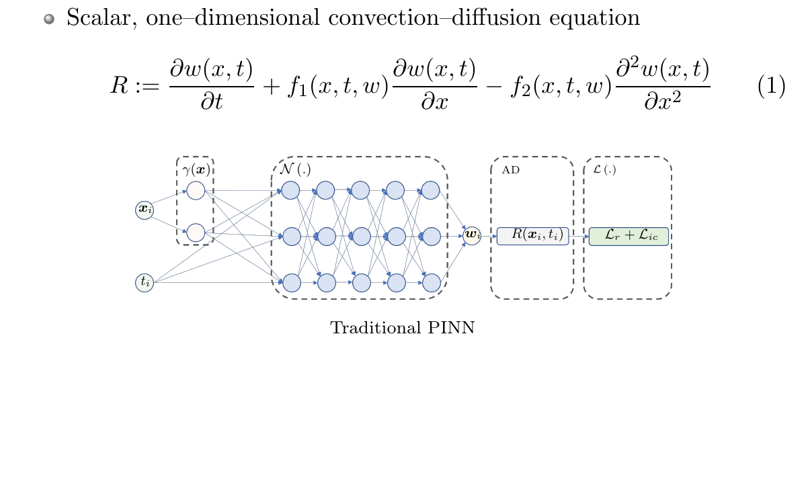

# Lagrangian physics-informed neural networks - LPINNs

#### [[project website]](http://pedram.rice.edu/team/)


## Table of contents
* [Introduction](#Introduction)
* [Requirements](#Requirements)
* [Experiments](#Experiments)
    * [Train](#train_sh)
    * [Post](#post_sh)
* [How to cite?](#How_to_cite?)
* [References](#References)

## Introduction
<!-- An abstract length introduction 
	to the project -->
Physics–informed neural networks (PINNs) leverage neural–networks to find the solutions of partial differential equation (PDE)–constrained optimization problems with initial conditions and boundary conditions as soft constraints.
We propose reformulating PINNs on a Lagrangian frame of reference, i.e., LPINNs, as a PDE–informed solution. A parallel architecture with two branches is proposed. One branch solves for the state variables on the characteristics, and the second branch solves for the low–dimensional characteristics curves. The proposed architecture conforms to the causality innate to the convection, and leverages the direction of travel of the information in the domain.

Our contribution is threefold
<ul>
<li>Explain complexity of training through lens of approximation theory,</li>
<li>Identify viscous Burgers' equation with moving shock as a challenging case, and </li>
<li>Propose Lagrangian PINNs as a causality conforming architecture for convection-dominated convection diffusion PDEs.</li>
</ul>

## Requirements
<!-- python -->
- python 3.6
	- [scipy](https://pypi.org/project/scipy/)
	- [numpy](https://pypi.org/project/numpy/)
- [Pytroch 1.10.1](https://pytorch.org/blog/pytorch-1.10-released/)
- [PyHessian 0.10](https://github.com/amirgholami/PyHessian/)


## Experiments

Main file
```
LPINN.py 
```
accepts the following arguments 
```

# Case parameters
parser.add_argument('--EQN_TYPE', type=str, default='convection',\
                    choices=['Burgers', 'convection', 'reaction_diffusion', 'reaction'], help='Equation type')
parser.add_argument('--C', type=float, default='50.0', help='Convection/wave speed')
parser.add_argument('--NU0', type=float, default='0.01', help='Viscosity')

parser.add_argument('--U0_TYPE', type=str, default='gauss',\
                    choices=['exp' , 'gauss', 'sin','bell','sin(x)'], help='Initial condition case')
parser.add_argument('--to', type=float, default=1.0, help='t_{max}')
    
# Architecture parameters
parser.add_argument('--NET_TYPE', type=str, default='LPINN_POLAR',\
                    choices=['LPINN_POLAR', 'PINN_POLAR'], help='Network type')
parser.add_argument('--DEEPu', type=int, default=5, choices=range(1, 10), help='u-Network deep layers')
parser.add_argument('--DEEPx', type=int, default=2, choices=range(1, 10), help='x-Network deep layers --- TO BE developed')
parser.add_argument('--HIDDEN', type=int, default=50, choices=range(1, 10), help='Nodes in deep layers')
parser.add_argument('--SEED', type=int, default=0, help='Pseudop-random seed')

# Data parameters
#parser.add_argument('--NOISE_MAG', type=float, default=0.0001, help='Noise magnitude (ratio to ??? )')
parser.add_argument('--N', type=int, default=256, choices=range(200, 500), help='Space')
parser.add_argument('--M', type=int, default=100, choices=range(100, 1000), help='Time')

# Optimizer parameters
parser.add_argument('--NUM_EPOCHS_ADAM', type=int, default=int(1e6), help='Number of epoch, ADAM')
parser.add_argument('--NUM_EPOCHS_SGD', type=int, default=int(0), help='Number of epoch, SGD')
parser.add_argument('--NUM_EPOCHS_BFGS', type=int, default=int(1e2), help='Number of epoch, BFGS')
parser.add_argument('--LR0', type=float, default=0.01, help='[Initial] learning rate')

parser.add_argument('--GAMMA_RX', type=float, default=10.0, help='GAMMA_RX')
parser.add_argument('--GAMMA_RU', type=float, default=1.0, help='GAMMA_RU')
parser.add_argument('--GAMMA_IC', type=float, default=1000.0, help='GAMMA_IC')
parser.add_argument('--GAMMA_BC', type=float, default=10.0, help='GAMMA_BC')
```
### <a name="train_sh?"></a>
Train bash <!-- A [Case 1 Location](./experiments/case1)  -->
```
bash train_LPINN.sh
```

### <a name="post_sh?"></a>
Post-process bash
```
bash post_LPINN.sh
```

## How to cite?<a name="How_to_cite?"></a>
- \[0\] [Mojgani, R.](https://www.rmojgani.com), [Balajewicz, M.](https://scholar.google.com/citations?user=FLg_n08AAAAJ), and [Hassanzadeh, P.](http://pedram.rice.edu/director/). "Lagrangian PINNs: A causality-conforming solution to failure modes of physics-informed neural networks", arXiv (2022).([url](https://doi.org/10.1175/JAS-D-20-0214.1))<details><summary>BibTeX</summary><pre>
@article { Mojgani_arxiv_2022,
      author = {Mojgani, Rambod and Balajewicz, Maciej and Hassanzadeh, Pedram},
      title = {Lagrangian PINNs: A causality-conforming solution to failure modes of physics-informed neural networks},
      journal = {},
      year = 2022,
      month = may,
      publisher = {},
      address = {},
      volume = {},
      number = {},
      doi = {},
      pages= {1-15},
      url = "https://"
}</pre></details>

## References
The Lagrangian framework for data-driven modeling of convection dominated flows was first introduced in [1], especifically in projection-based reduced order modeling (pROMs). 
The literature on challenges and remedies of training of PINNs is dissused in our paper [0]. 
This work is highly inspired by ``failure modes of PINNs`` [2], and discussion of ``causality in training of PINNs`` [3]. 
The code to compute the loss landscape of NN is an opensource package, ``PyHessian`` [4], and is modified for our purpose under ``MIT License``. 
Future work includes generalization of our method to address Kolmogorov n-width using low-rank registeration based auto-encoder/manifold [5]

- \[1\] [Mojgani, R.](https://www.rmojgani.com) and [Balajewicz, M.](https://scholar.google.com/citations?user=FLg_n08AAAAJ),
[**Lagrangian basis method for dimensionality reduction of convection dominated nonlinear flows.**](https://arxiv.org/abs/1701.04343)
arXiv:1701.04343, 2017.
([Download](https://arxiv.org/pdf/1701.04343))<details><summary>BibTeX</summary><pre>
@article{Mojgani_arxiv_2017,
	author={Mojgani, Rambod and Balajewicz, Maciej},
	title={Lagrangian basis method for dimensionality reduction of convection dominated nonlinear flows},
	journal={arXiv preprint arXiv:1701.04343},
	archivePrefix="arXiv",
	eprint={1701.04343},
	year=2017,
}</pre></details>


- \[2\] Krishnapriyan, A. S., Gholami, A. , Zhe. Shandian, , Kirby, R. M. and Mahoney, M. W. [**Characterizing possible failure modes in physics-informed neural networks**](https://openreview.net/forum?id=a2Gr9gNFD-J),  Neural Information Processing Systems (NeurIPS), 2021, [*code*](https://github.com/a1k12/characterizing-pinns-failure-modes).


- \[3\] Wang, S., Sankaran, S., Perdikaris, P. [**Respecting causality is all you need for training physics-informed neural networks**](https://arxiv.org/abs/2203.07404),  arXiv:2203.07404, 2021.


- \[4\] Z. Yao, A. Gholami, K Keutzer, M. Mahoney. [**PyHessian: Neural Networks Through the Lens of the Hessian**](https://arxiv.org/abs/1912.07145), Spotlight at ICML workshop on Beyond First-Order Optimization Methods in Machine Learning, 2020, [*code*](https://github.com/amirgholami/PyHessian).

- \[5\] [Mojgani, R.](https://www.rmojgani.com) and [Balajewicz, M.](https://scholar.google.com/citations?user=FLg_n08AAAAJ),
[**Low-Rank Registration Based Manifolds for Convection-Dominated PDEs.**](https://ojs.aaai.org/index.php/AAAI/article/view/16116)
_in Proceedings of Association for the Advancement of Artificial Intelligence_, Virtual Conference, February, 2021. Paper AIAA-2021-8654.
([Download](https://ojs.aaai.org/index.php/AAAI/article/view/16116/15923))<details><summary>BibTeX</summary><pre>@article{Mojgani_AAAI_2021, 
	title={Low-Rank Registration Based Manifolds for Convection-Dominated {PDE}s},
	volume={35}, 
	url={https://ojs.aaai.org/index.php/AAAI/article/view/16116}, 
	number={1}, 
	journal={Proceedings of the AAAI Conference on Artificial Intelligence},
	author={Mojgani, Rambod and Balajewicz, Maciej}, 
	year=2021, 
	month=may, 
	pages={399-407},
}</pre></details>

